# Gojek dummy 🟢🏍️
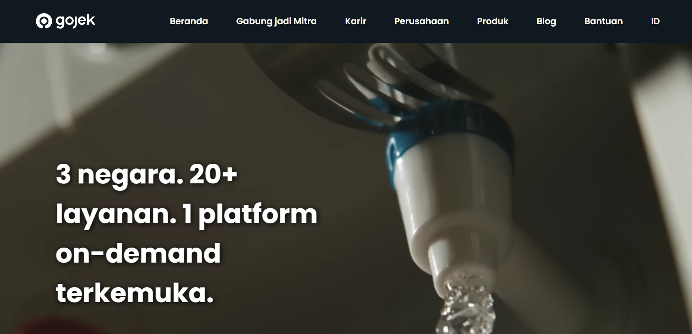
if you interest, you can click [here](https://gojek-by-david.vercel.app/) to see my website before custom domain, and [here](https://www.spiderclub.site/) after custom domain 👈🔗

for disclaimer, I used a custom domain from my previous project to save budget 😅

# Table of Contents 📃
- [Structures 📜](#structures)
- [Materials 🧱](#materials)
- [How to setup 🛠️](#how-to-setup)
- [Deployment & Custom Domain ⚙️](#deployment--custom-domain)
    - [Deployment](#deployment)
    - [Custom Domain](#custom-domain)
- [Author 👦](#author)

# Structures
- Header
  - Navbar
- Main
  - Video Banner
  - Introduction
  - Scale
  - Offering
  - Reason
  - Product
  - Loyalti
- Footer

# Materials
- HTML
- CSS
- JavaScript
- External/Internal Sources
  - Icon
  - Picture (png, jpg, webp, svg)
  - Video

# How to setup
You will need a github account to clone this repository, make sure you're connected to github.

1. Clone this repository
```
https://github.com/RevoU-FSSE-4/milestone-1-davidfrdian.git
```
2. Create a new branch named "develop", in this repository we would like to develop the website with personal information
```
git branch -b "develop"
```
3. Once it's created, checkout to a new branch
```
git checkout -b "develop"
```
4. Develop & modify the website with your personal information, after it's done you will need to push it
```git add .
git commit -m "update message" // make sure to give details commit message to get better logs
git push origin develop
```
5. Once you're done, you can merge into main branch for production build
```
git checkout main
git pull origin main // pull the latest version before commit merge
git merge develop // if there are any conflicts, you should resolve them manually
git commit -m "Merge develop into main"
git push origin main
```

# Deployment & Custom Domain
## Deployment
1. Open Vercel on this [link](https://vercel.com) and login with anything choice do you want
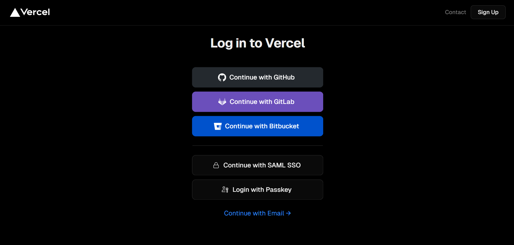

2. This is the initial view of vercel
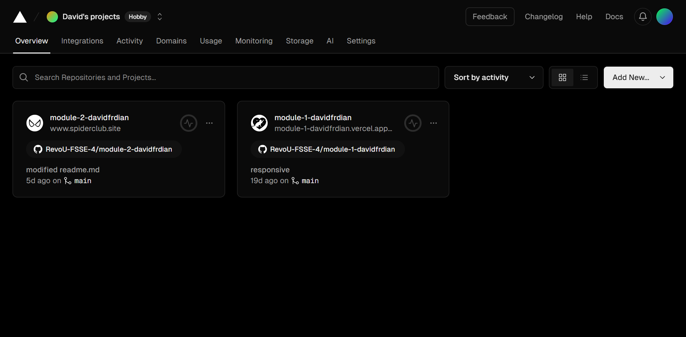

3. Click 'Add New' and choose 'Project'
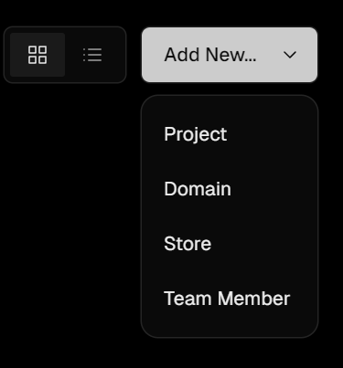

4. You are in the project build view now
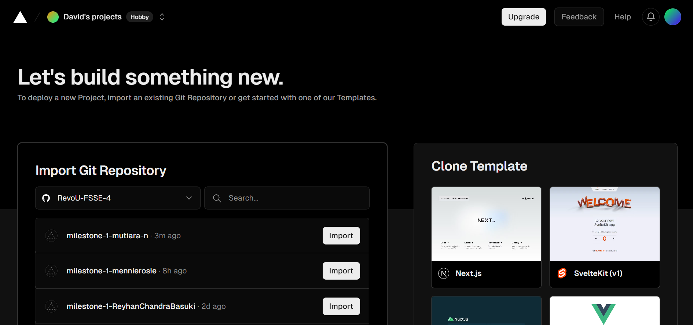

5. Choose your Github account on this feature
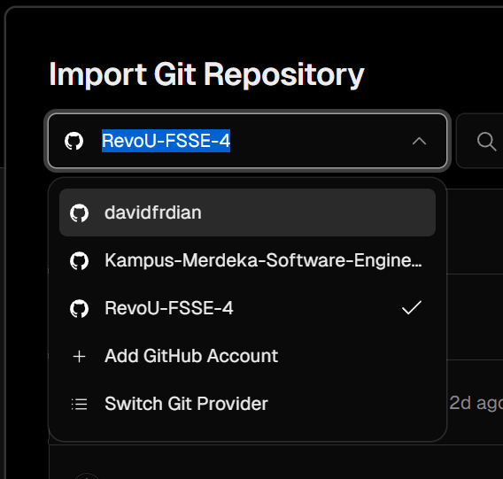

6. After that, search your repository with search bar and import it
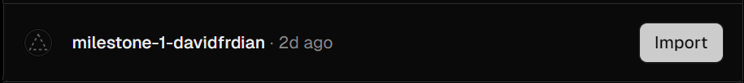

7. Your almost done, deploy your website with click 'deploy'
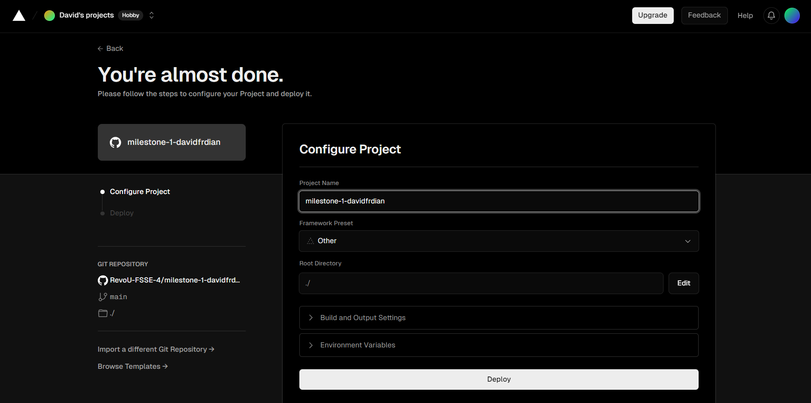

8. Congratulations!! your website is already deploy 🎉🎊🍾
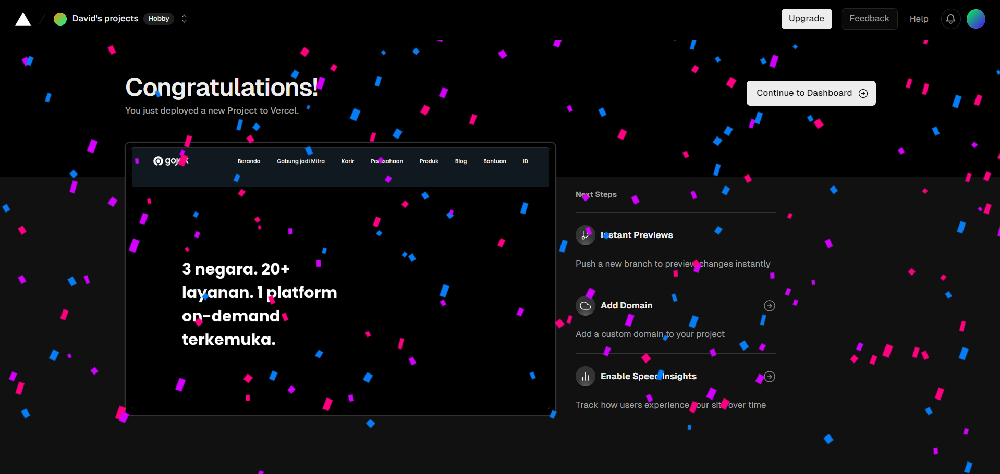

9. You can custom your domain with click domain feature and click edit
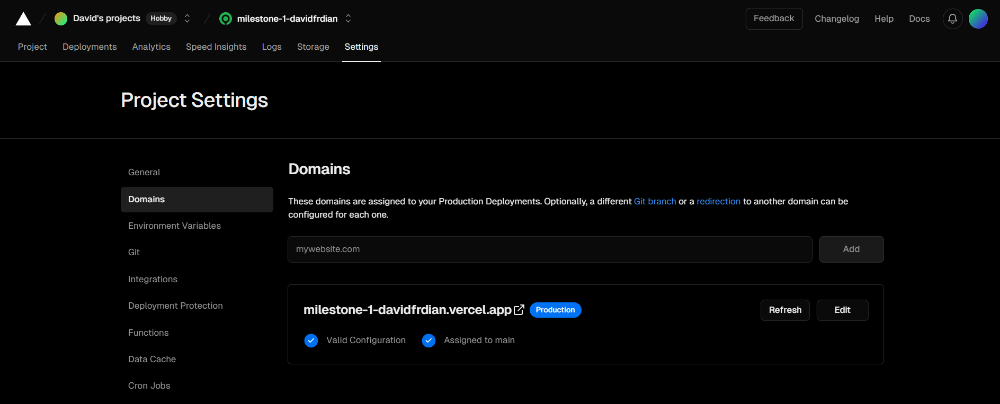

10. This is your domain after custom in vercel
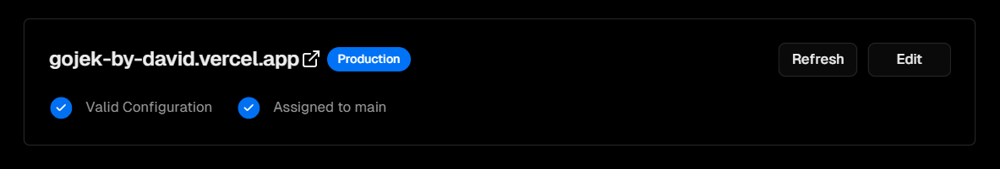

11. Open your website and check your domain name, definitely it's already change 😎
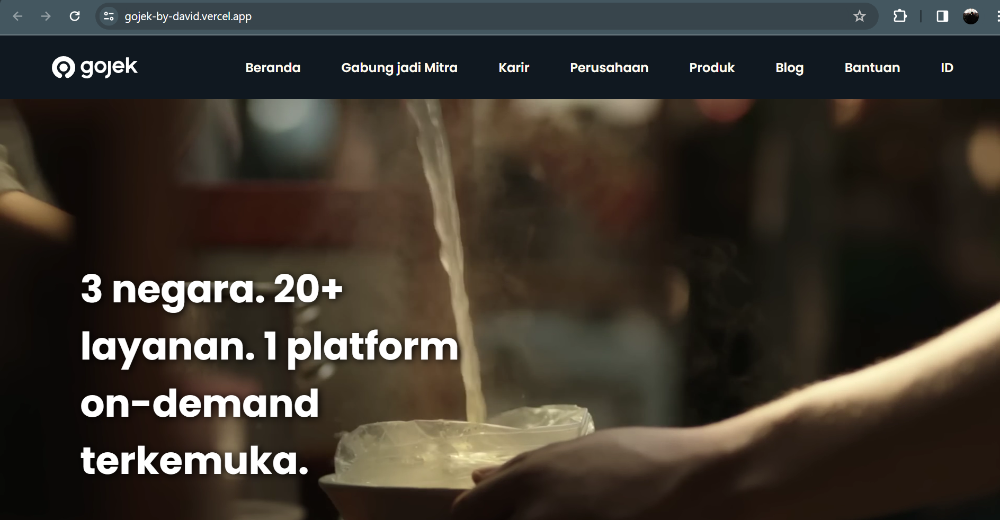

## Custom Domain
1. Open Vercel again on [here](https://vercel.com)
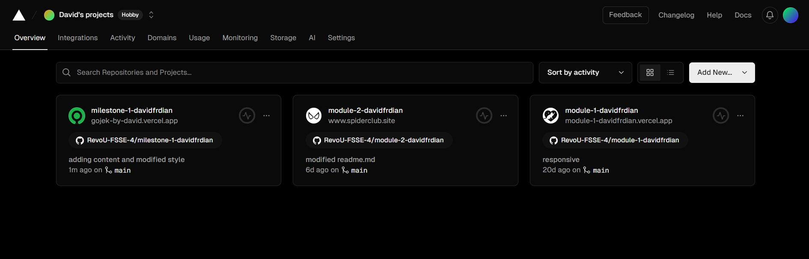

2. Click domains feature on your project that you want to custom
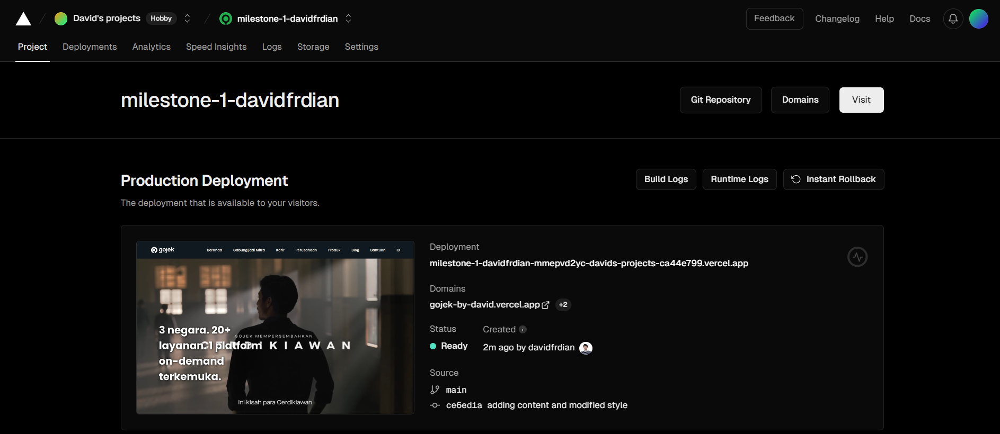

3. Type in the custom domain that you have purchased before
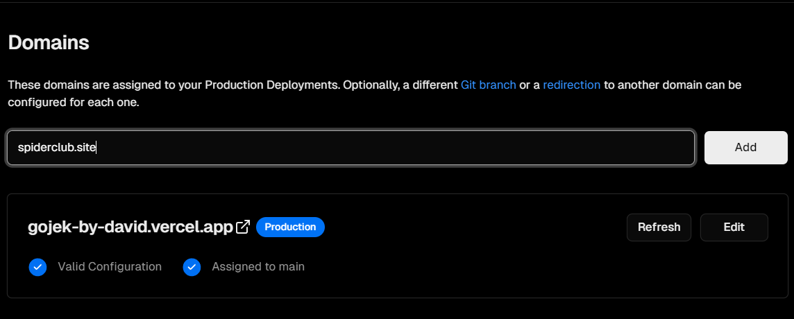

4. Invalid configuration will appear like this
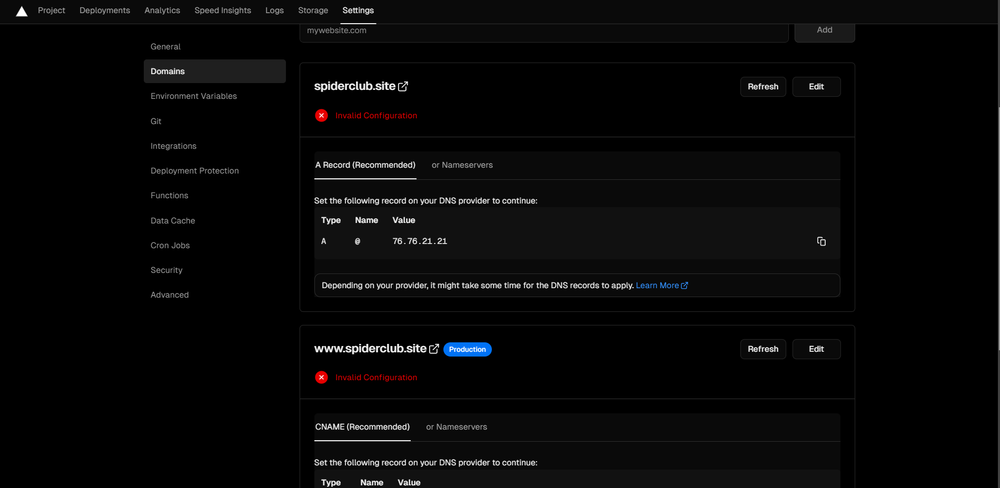

5. Click on Name Servers and you will see what name server you are currently using, after that copy the available name server in 'intented Nameservers'
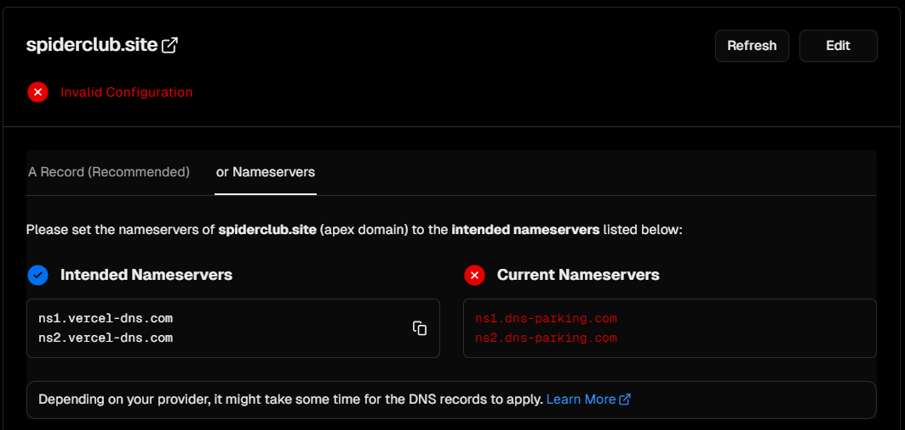

6. After that, open [Niagahoster](https://niagahoster.com) and enter the domain management that you have purchased, change the nameservers in that feature
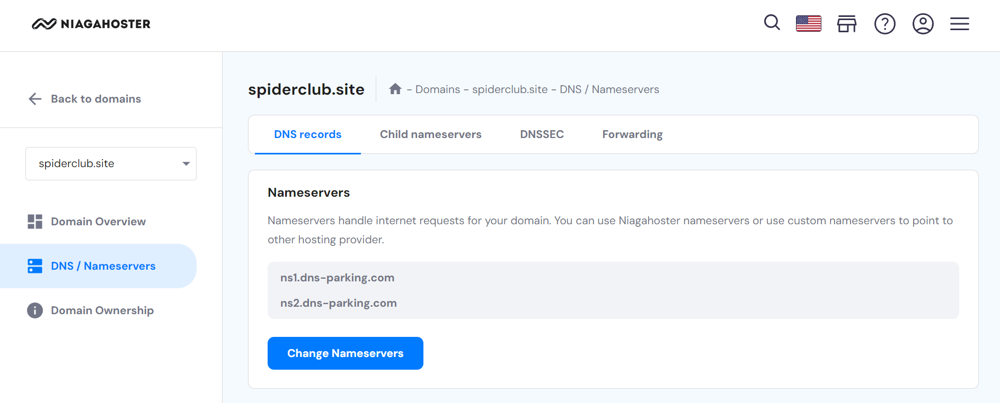

7. Nameservers has been changed, it may take several hours for the domain to propagate
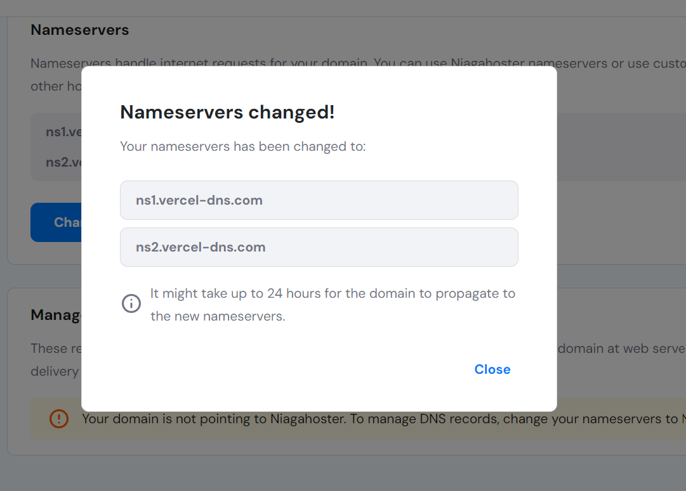

8. You can check the domain status on Vercel periodically, if it has propagated, the status will change to 'Valid Configuration'
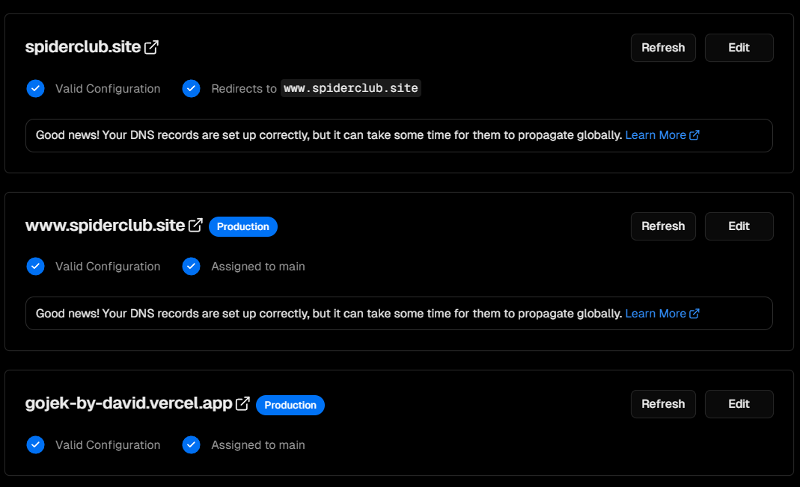

9. Go to your website to check your custom domain, if it has changed, congratulations! 🎊🎉 the custom domain process is complete. If not, you need to wait a little longer and try checking regularly 💪
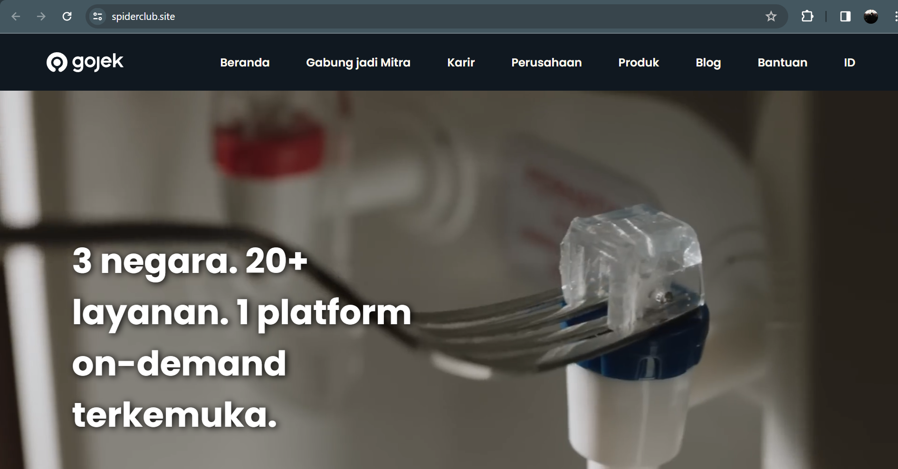

# Author
- LinkedIn: [David Ferdian](https://www.linkedin.com/in/davidferdian)
- Instagram: [David Ferdian](https://www.instagram.com/david_f.h/)
